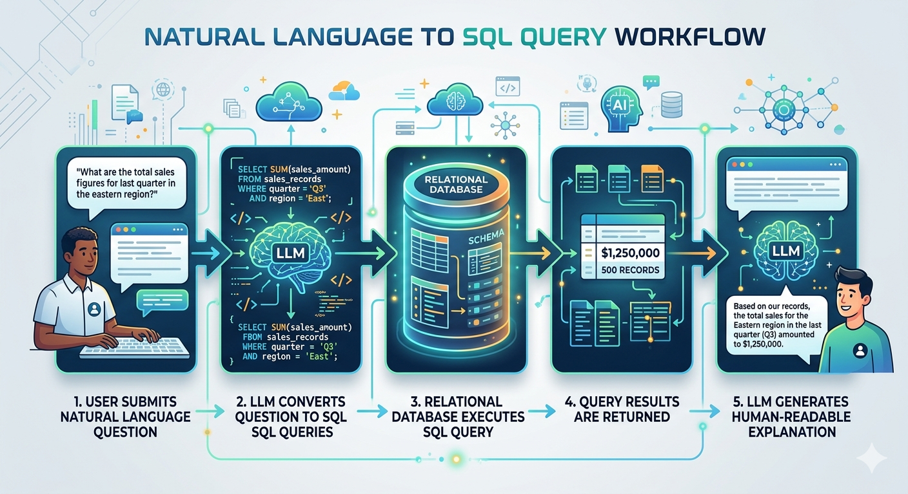

# AI SQL Analyst

## Overview
This project demonstrates how to build a simple AI-powered data analytics application that allows users to ask questions about data in natural language. The application converts the question into a SQL query using a Large Language Model (LLM), executes the query against a relational database, and returns both the results and an AI-generated explanation.

## Goal
This repository is built as a hands-on learning project for developers exploring **AI-powered data applications**.

- Python backend development
- SQL-based analytics
- LLM APIs
- Lightweight application interfaces

The project mirrors the architecture used in modern **AI-powered analytics tools** and **data assistants**.

## Application Architecture
1.  User submits a natural language question in **plain English**
2.  The LLM converts the question into **SQL Queries**
3.  A relational database executes the SQL query
4.  Query results along with visualizations are returned
5.  The LLM generates a human-readable explanation

## Technology Stack
- Backend: Python
- AI / LLM Integration: OpenAI API
- Database: SQLite (default), PostgreSQL (optional)
- Data Processing: Pandas, SQLAlchemy
- UI: Streamlit

## Example Usage
Input: "What cities had the most orders last month?"  

Output:
<table>
  <thead>
    <tr>
      <th scope="col">City</th>
      <th scope="col">Orders</th>
    </tr>
  </thead>
  <tbody>
  <tr>
    <td>New York</td>
    <td>1200</td>
  </tr>
   <tr>
    <td>Chicago</td>
    <td>980</td>
  </tr>
   <tr>
    <td>Austin</td>
    <td>860</td>
  </tr>
  </tbody>
</table>

Analysis: "New York recorded the highest number of orders last month, followed by Chicago and Austin."

## Potential enhancements:
-   Schema auto-discovery
-   Multi-step AI agents
-   Support for multiple databases
-   Dashboard-style analytics interface

## License
MIT License

